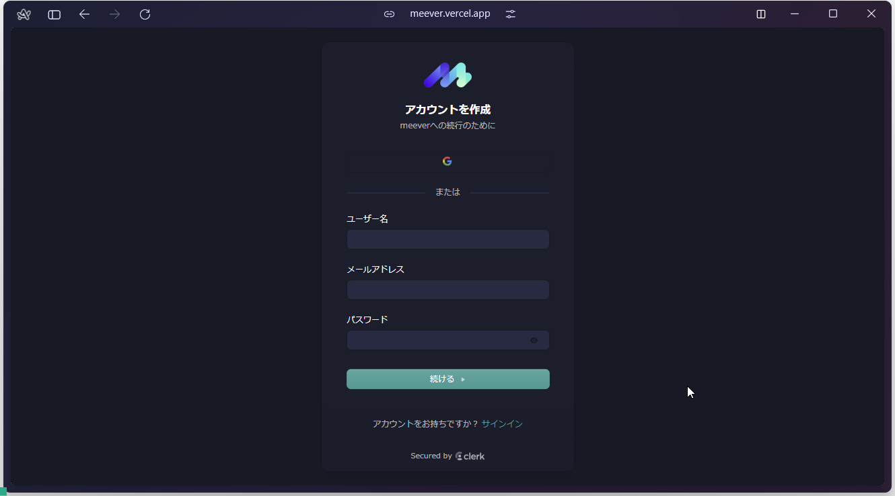

  

    
    
    
    
    
    
    
  

  <h3 align="center">Remote Meeting Video Caller</h3>

  

    誰でも開催・参加・録画・管理が可能なリモートミーティングアプリ
  

## 📋 <a name="table">Table of Contents</a>

1. 🤖 [はじめに](#intro)
2. 🔗 [URL](#url)
3. 🔋 [アプリの機能](#feature)
4. 🚀 [アプリの利用サンプル](#example)
5. 🤸 [終わりに](#outro)

## <a name="intro">🤖 はじめに</a>

今すぐミーティング、そして録画。今後のミーティングを計画できる。オンラインでカメラとマイクを使った打ち合わせ、雑談ができるアプリ、meever のご紹介。

## <a name="url">🔗 URL</a>

meever | Remote Meeting Video Caller  
https://meever.vercel.app/

## <a name="feature">🔋 アプリの機能</a>

### 👉 ユーザ認証システム

メールアドレス、または Google アカウントのログインによりユーザ認証を保護

### 👉 新しいミーティングの作成

新しいミーティングをその場で開始し、参加前にカメラとマイクの準備をサポート

### 👉 操作サポート

参加者は、録画、絵文字リアクション、画面共有、ミュート・ミュート解除、サウンド調整、表示レイアウトの変更、参加者リスト表示、参加者個別管理（ピン留め、ミュート、ミュート解除、ブロック、ビデオ共有許可）など、ミーティングのあらゆる操作をサポート

### 👉 ミーティングの終了

参加者はミーティングからいつでも退出可能。ミーティングの作成者は参加者全員のミーティングを終了させることができる

### 👉 今後のミーティングをスケジュール

会議の詳細（日付、時間）を入力し、今後開催予定のミーティングを予約設定

### 👉 過去のミーティングリスト

開催日時、詳細を含む、過去に開催されたミーティングのリストを表示

### 👉 録画したミーティングのチェック

過去に録画したミーティングにアクセスし、確認や録画の再生、ダウンロードをすることが可能

### 👉 プライベートルーム

ユーザは、インスタントミーティング用のミーティングリンクを持つプライベートルームを持つことができる。リンクは他のユーザーと共有することができる

### 👉 リンク経由でミーティングに参加

リンクを連携することで、アカウント登録していないユーザでも、ゲストとしてミーティングに参加することが可能

### 👉 セキュアなリアルタイム機能

プラットフォーム内でのやりとりはすべてセキュアでリアルタイムに行われ、すべてのユーザのプライバシーとデータの完全性を維持

## <a name="example">🚀 アプリの利用サンプル</a>

1. [アカウント登録](#sign-up)
2. [ログイン](#logged-in)
3. [ホーム画面](#home-page)
4. [インスタント ミーティング](#instant-meeting)
5. [ミーティングの追加](#add-meeting)
6. [ミーティングに参加](#join-meeting)
7. [ミーティング機能](#meeting-feature)
   1. [準備画面](#setup)
   2. [ミーティング画面](#meeting-page)
      1. [録画を開始](#start-recording)
      2. [リアクション](#reaction)
      3. [画面共有](#share-screen)
      4. [マイク](#mic)
      5. [カメラ](#camera)
      6. [通話終了](#leave-call)
      7. [表示切替](#switch-grids)
      8. [通話品質・パフォーマンス](#call-latency)
      9. [参加者表示](#paticipants)
      10. [コントロールメニュー（開催者）](#control-menu-as-organizer)
      11. [コントロールメニュー（参加者）](#control-menu-as-paticipant)
8. [今後のミーティング表示画面](#upcoming-page)
9. [過去のミーティング表示画面](#previous-page)
10. [録画チェック画面](#recordings-page)
11. [プライベートルーム画面](#personal-room)
12. [表示デバイスに柔軟に対応するレイアウト設計](#responsive)
13. [ログアウト](#logged-out)

### <a name="sign_up">1. アカウント登録</a>

### <a name="logged-in">2. ログイン</a>

### <a name="home-page">3. ホーム画面</a>

### <a name="instant-meeting">4. インスタント ミーティング</a>

### <a name="add-meeting">5. ミーティングの追加</a>

### <a name="join-meeting">6. ミーティングに参加</a>

### <a name="meeting-feature">7. ミーティング機能</a>

#### <a name="setup">7-1. 準備画面</a>

#### <a name="meeting-page">7-2. ミーティング画面</a>

##### <a name="reaction">7-2-1. 録画を開始</a>

##### <a name="reaction">7-2-2. リアクション</a>

##### <a name="share-screen">7-2-3. 画面共有</a>

##### <a name="mic">7-2-4. マイク</a>

##### <a name="camera">7-2-5. カメラ</a>

##### <a name="leave-call">7-2-6. 通話終了</a>

##### <a name="switch-grids">7-2-7. 表示切替</a>

##### <a name="call-latency">7-2-8. 通話品質・パフォーマンス</a>

##### <a name="paticipants">7-2-9. 参加者表示</a>

##### <a name="control-menu-as-organizer">7-2-10. コントロールメニュー（開催者）</a>

##### <a name="control-menu-as-paticipant">7-2-11. コントロールメニュー（参加者）</a>

### <a name="upcoming-page">8. 今後のミーティング表示画面</a>

### <a name="previous-page">9. 過去のミーティング表示画面</a>

### <a name="recordings-page">10. 録画チェック画面</a>

### <a name="personal-room">11. プライベートルーム画面</a>

### <a name="responsive">12. 表示デバイスに柔軟に対応するレイアウト設計</a>

### <a name="logged-out">13. ログアウト</a>

## <a name="outro">🤸 おわりに</a>

このリモートミーティング機能は基本的なもので、さらに様々な機能を追加することができます。また、機能が部品化されているため、他のアプリにこのリモートミーティング機能を組み込むことも簡単できます。
